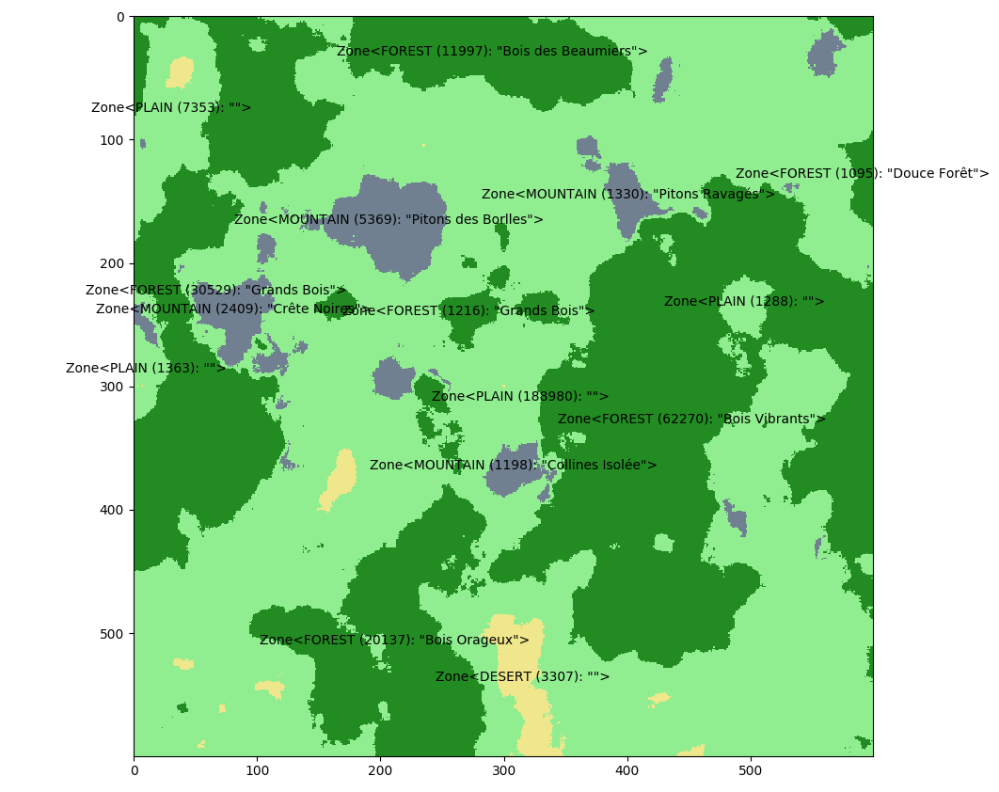
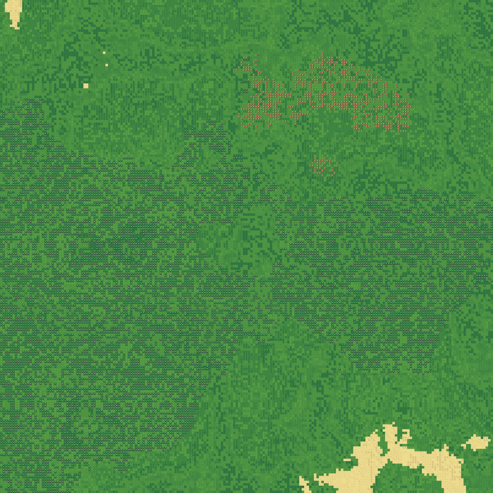

# RolePy

A 2D scrolling RPG game, with procedural universe including lore and terrain.

## 1. Roadmap towards _RolePy-alpha_

### 1.1. Basic Game Engine Implementation

 - [x] Terrain procedural generation tools
 - [x] Infinite 2D terrain rendering
 - [x] Display an HUD
 - [ ] Handle AI-powered entities
 - [ ] Generate multi-tiles structures
 - [ ] Handle events on action triggering or bound crossing
 - [ ] Generate events

### 1.2. Game Direction Definition

 - [ ] Define the goal of the game
 - [ ] Define the main means of pursuing this goal
 - [ ] ???

## 2. Setup

Current implementation uses the [pygame](https://www.pygame.org/news) module
for Python (find here the [documentation](https://www.pygame.org/docs)).

The configuration file, `settings.txt`, follows the following format:

```
# Window size in pixels
# resolution=928*544
resolution=928*544

# FPS cap (leave empty for unlimited)
# max_fps=144
max_fps=

# Time between two touchdown events
# key_repeat_delay=10
key_repeat_delay=10
```

## 3. Demonstration

### 3.1. Biome Generation



### 3.2. Terrain Rendering

with world seed *1358336837*


