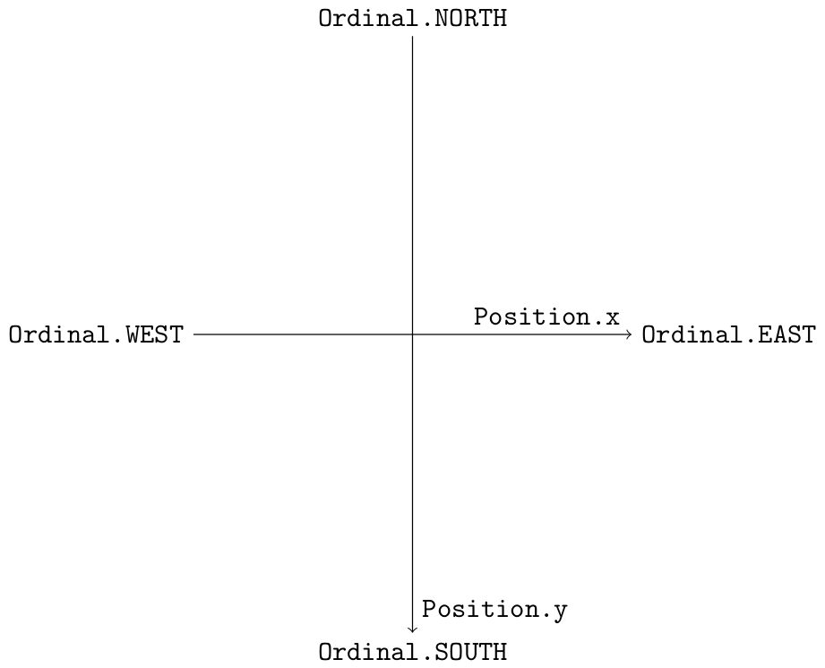

Core module
===========

The core module contains basic **data structures** such as ``Fifo``
(first-in-first-out) with a streaming average computation, used for FPS
monitoring, or ``Position`` which implements basic tools for 2D vectors.

It also contains simple functions for various usage in the ``misc`` submodule.

Coordinates
-----------

Here is a summary of how the coordinates system works in the game.
It is consistent with how PyGame coordinates system works.

   Coordinates system for the RolePy engine

The ``angle_direction`` function in the ``misc`` submodule gives the main
direction a vector of a given angle is pointing to. For instance, we have:

.. code-block:: python

    >>> angle_direction(Position(0, 1).angle())
    <Ordinal.SOUTH: 3>

Ansynchronous Tasks
-------------------

The core module contains the ``TaskManager``, which controls the secondary
threads that execute various **tasks** for the game. Such tasks inherit from
the ``AsyncTask`` class, which in turn inherits from the ``threading.Thread``
class.

Executing an asynchronous task through the task manager is not mandatory, but
it can ensure that only one similar task is executed at a time.
